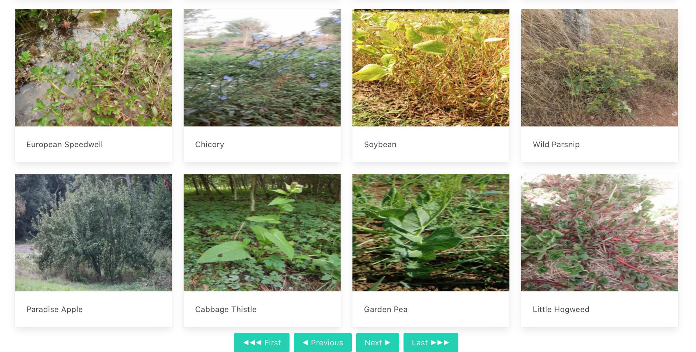
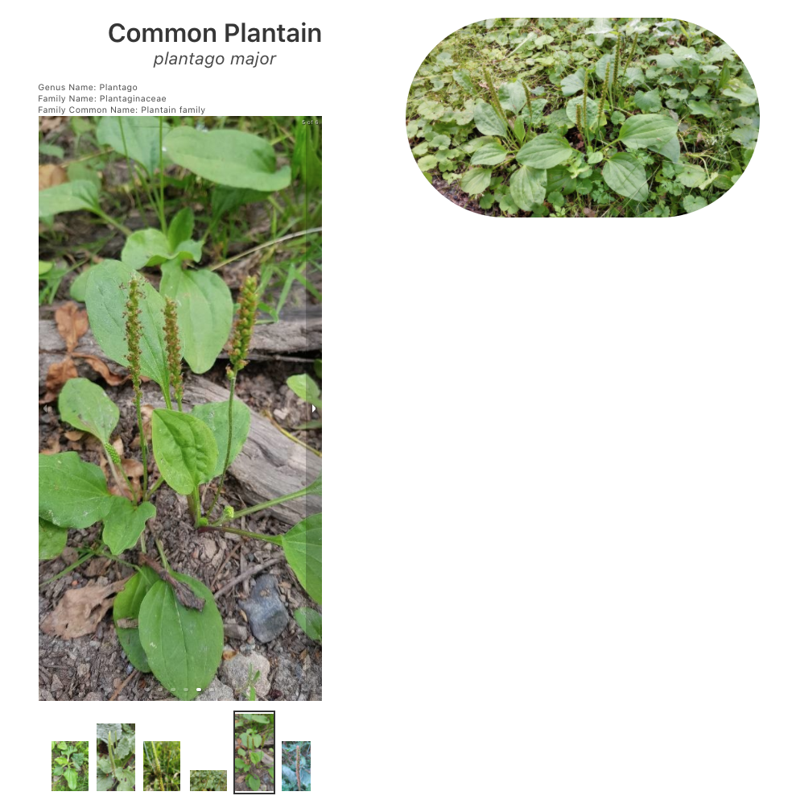

# SEI50 Project - ***Reactathon***

## Application Outline
The application is an edible plant index allowing users to search by common and scientific names along with other attributes.

## Project Brief
Collaborate remotely with one teammate to pair code a React application that consumes a public RestAPI. Project must be planned and completed within 36 hours.

## Technologies Used
* JavaScript
* React
* react-router-dom
* Axios
* Heroku cors-anywhere
* SCSS
* Bulma
* react-responsive-carousel
* Insomnia

## API - Trefle.io
Trefle is an open API providing botanical information for over 1 million plants.

## Process
With limited time, we decided on a straightforward layout page to index the initial results, with the goal of including several ways to filter the results. Given the massive amount of data available from Trefle, we quickly opted to focus on edible plants. In the initial half of the allotted time, we struggled to work around issues arising from our API requests and CORS. Ultimately, we utilized the cors-anywhere proxy from Heroku.

Though the time spent working on that issue significantly impacted our initial plans. We successfully created a search option and added in a few extra features to add substance to the app. The response data provided page numbers with links which allowed us to paginate the results for a user and include navigation buttons below the listed results.

  

The react-responsive-carousel component allowed us to quickly implement an image carousel for a user when viewing its details.

  

